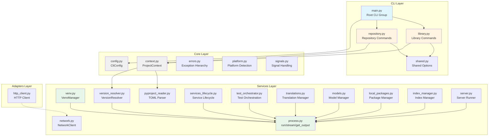
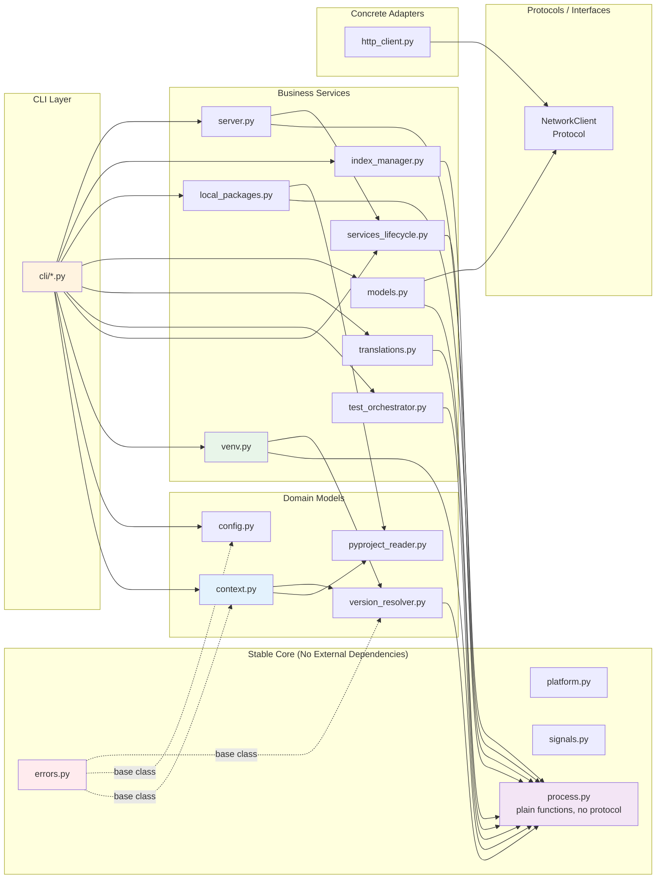
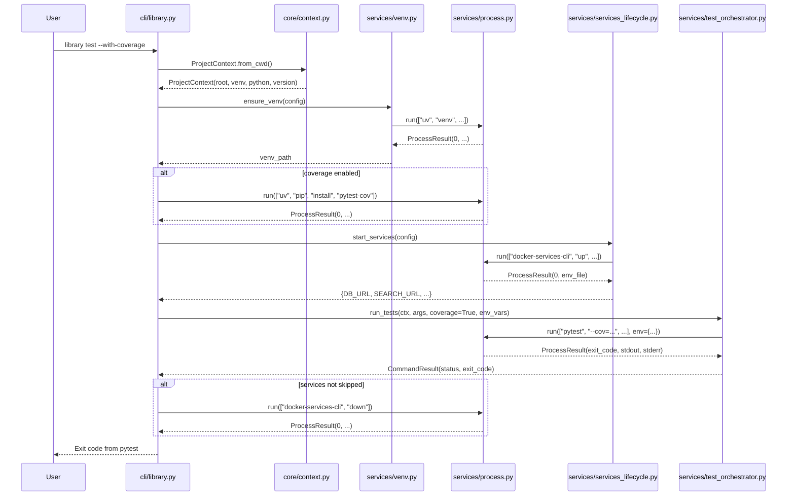
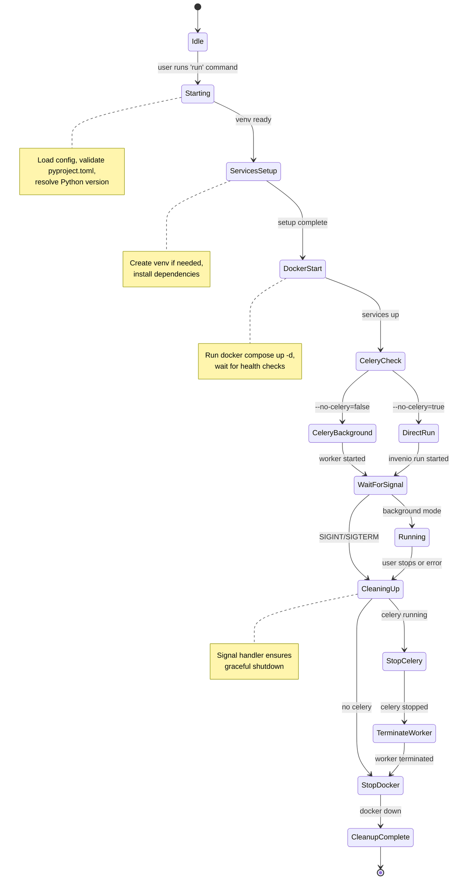

# OARepo CLI Detailed Design

## 1. Package Component Diagram



## 2. Dependency Direction Diagram



## 3. Library Command Execution Flow

Example: `oarepo-cli library test --with-coverage`



## 4. Repository Installation Flow

Example: `oarepo-cli repository install`

```mermaid
sequenceDiagram
    participant User
    participant CLI as cli/repository.py
    participant Ctx as core/context.py
    participant Venv as services/venv.py
    participant Proc as services/process.py
    participant Trans as services/translations.py
    participant Cli as services/invenio_cli.py
    participant Svc as services/services_lifecycle.py

    User->>CLI: repository install
    CLI->>Ctx: ProjectContext.from_cwd()
    Ctx-->>CLI: ProjectContext

    CLI->>Venv: ensure_venv(config)
    Venv->>Proc: run(["uv", "sync", ...])
    Proc-->>Venv: ProcessResult

    CLI->>Trans: copy_translations(ctx)
    Trans->>Proc: run(["python", "-c", "import site; ..."])
    Proc-->>Trans: site_packages_path
    Trans->>Proc: cp -R src/. site_packages/

    CLI->>Cli: install(ctx)
    Cli->>Proc: run(["invenio-cli", "install"])
    Proc-->>Cli: ProcessResult

    CLI->>Svc: configure_local_ports(ctx)
    Svc->>Proc: read(variables file)
    Proc-->>Svc: port mappings
    Svc->>Proc: write(.invenio.private)

    CLI->>Trans: compile_be_translations()
    Trans->>Cli: run(["invenio-cli", "translations", "compile"])

    CLI-->>User: Success message with next steps
```

## 5. Long-Running Server Execution with Signal Handling

Example: `oarepo-cli repository run`



## 6. Key Interfaces

### Process Execution Helper

Plain module-level functions, not a `Protocol`/`ABC` — there is exactly one real way to run a subprocess, so nothing is gained by making this swappable. Every service imports `oarepo_cli.services.process` and calls `process.run(...)` directly; no constructor injection.

```python
# services/process.py

from dataclasses import dataclass
from pathlib import Path
from typing import Optional, Sequence, Iterator


@dataclass
class ProcessResult:
    """Result of a subprocess execution."""

    returncode: int
    stdout: str
    stderr: str
    command: Sequence[str]
    cwd: Path
    duration_ms: int

    @property
    def success(self) -> bool:
        return self.returncode == 0

    def check(self) -> "ProcessResult":
        """Raise ProcessExecutionError if command failed."""
        if not self.success:
            raise ProcessExecutionError(
                command=self.command,
                returncode=self.returncode,
                stdout=self.stdout,
                stderr=self.stderr,
            )
        return self


def run(
    command: Sequence[str],
    *,
    cwd: Optional[Path] = None,
    env: Optional[dict[str, str]] = None,
    capture_output: bool = True,
    check: bool = True,
    forward_stdout: bool = False,
    timeout: Optional[float] = None,
) -> ProcessResult:
    """
    Execute a command and wait for completion. Never uses shell=True.

    Args:
        command: List of arguments (never shell string)
        cwd: Working directory
        env: Environment variables (merged with parent)
        capture_output: Capture stdout/stderr strings
        check: Raise on non-zero exit code
        forward_stdout: Stream output while capturing
        timeout: Maximum execution time in seconds

    Returns:
        ProcessResult with exit code, output, timing

    Raises:
        ProcessExecutionError: If check=True and returncode != 0
        TimeoutExceeded: If timeout is exceeded
    """
    ...


def stream(
    command: Sequence[str],
    *,
    cwd: Optional[Path] = None,
    env: Optional[dict[str, str]] = None,
) -> Iterator[str]:
    """
    Execute a command and yield output lines as they're produced.

    Use for long-running commands where real-time output is needed.

    Yields:
        Lines of stdout interleaved with stderr
    """
    ...


def get_output(
    command: Sequence[str],
    *,
    cwd: Optional[Path] = None,
    env: Optional[dict[str, str]] = None,
) -> str:
    """
    Execute a command and return stripped stdout.

    Convenience function for commands like `python -c "print(...)"`.
    """
    ...
```

### VirtualEnvironmentManager Interface

```python
# services/venv.py

import shutil
from dataclasses import dataclass
from pathlib import Path
from typing import Optional

from oarepo_cli.services import process


@dataclass
class VenvRequirements:
    python_binary: str
    oarepo_version: Optional[int] = None
    extras: list[str] = None
    editable: bool = True

    def __post_init__(self):
        if self.extras is None:
            self.extras = []


class VirtualEnvironmentManager:
    """Manages Python virtual environments via uv."""

    def __init__(self, config: CliConfig):
        self._config = config

    def ensure_venv(
        self,
        requirements: VenvRequirements,
        force: bool = False,
    ) -> Path:
        """
        Ensure virtual environment exists with required packages.

        Args:
            requirements: Python version, OARepo version, extras
            force: Remove existing venv and recreate

        Returns:
            Path to virtual environment

        Raises:
            VersionMismatchError: If Python version incompatible
            ProcessExecutionError: If uv commands fail
        """
        venv_path = self._config.venv.path

        if force and venv_path.exists():
            shutil.rmtree(venv_path)

        if not venv_path.exists():
            self._create_venv(requirements.python_binary, venv_path)

        self._install_dependencies(requirements, venv_path)

        return venv_path

    def ensure_venv_exists(
        self,
        requirements: VenvRequirements,
        quiet: bool = False,
    ) -> Path:
        """
        Ensure venv directory exists, without syncing dependencies.

        Unlike ensure_venv(), this never re-verifies or reinstalls
        dependencies — it only checks that the directory is present.
        Intended for commands that just need somewhere to run from
        (shell, invenio, test) rather than a full dependency sync.

        Args:
            requirements: Requirements to use if venv needs to be created
            quiet: If True, suppress command output

        Returns:
            Path to virtual environment

        Raises:
            VersionMismatchError: If Python version incompatible
            ProcessExecutionError: If uv commands fail
        """
        venv_path = self._config.venv.path
        if venv_path.exists():
            return venv_path
        return self.ensure_venv(requirements, force=False)

    def _create_venv(self, python: str, path: Path) -> None:
        """Create fresh virtual environment."""
        process.run(
            ["uv", "venv", "--python", python, "--seed", str(path)],
            check=True,
        )

    def _install_dependencies(
        self,
        requirements: VenvRequirements,
        venv_path: Path,
    ) -> None:
        """Install OARepo and project dependencies using uv sync.

        For libraries, uses `uv sync` to install from pyproject.toml and generate
        a uv.lock file. The lockfile ensures reproducible builds but should be
        gitignored for libraries (only repositories commit lockfiles).

        For non-editable installs, builds a wheel first and installs that.
        """
        # For editable installs, use uv sync
        if requirements.editable:
            # uv sync reads pyproject.toml, resolves dependencies, generates uv.lock,
            # and installs everything (including the project itself in editable mode)
            extras_arg = ",".join(requirements.extras) if requirements.extras else "dev,tests"
            process.run(
                [
                    "uv",
                    "sync",
                    "--extra",
                    extras_arg,
                ],
                check=True,
            )
        else:
            self._build_and_install_wheel(requirements)

    def upgrade_environment(self) -> None:
        """Clean cache and recreate venv from scratch."""
        self.ensure_venv(VenvRequirements(...), force=True)

    def cleanup(self) -> None:
        """Remove virtual environment and related files."""
        venv_path = self._config.venv.path
        if venv_path.exists():
            shutil.rmtree(venv_path)
```

### PyProjectReader Interface

```python
# services/pyproject_reader.py

from dataclasses import dataclass
from pathlib import Path
from typing import Any


@dataclass
class PyProjectData:
    """Parsed pyproject.toml with typed accessors."""

    raw: dict[str, Any]

    @property
    def name(self) -> str:
        """Package name from [project].name."""
        return self.raw["project"]["name"]

    @property
    def homepage(self) -> str:
        """Homepage URL from [project].urls.Homepage."""
        return self.raw["project"]["urls"]["Homepage"]

    @property
    def requires_python(self) -> str:
        """Python version constraint from [project].requires-python."""
        return self.raw["project"]["requires-python"]

    @property
    def dependencies(self) -> list[str]:
        """List of dependency specifiers."""
        return self.raw["project"].get("dependencies", [])

    @property
    def optional_dependencies(self) -> dict[str, list[str]]:
        """Optional extra dependencies."""
        return self.raw["project"].get("optional-dependencies", {})

    @property
    def oarepo_versions(self) -> list[int]:
        """Extract OARepo major versions from dependency constraints.

        Scans [project].dependencies and [project].optional-dependencies for
        'oarepo' package references and extracts major version numbers from
        version constraints.

        Supports patterns like:
          oarepo>=14.0.0,<15.0.0  → 14
          oarepo>=13.0.0,<14.0.0  → 13
          oarepo==14.0.5         → 14

        Returns:
            List of unique major versions, sorted highest-first.
            Example: [14, 13] for a project using oarepo 14 in main deps
                     and oarepo 13 in tests extra.

        Note:
            This replaces the Step 3.12 approach of reading from
            [tool.oarepo-cli].version, eliminating duplicate configuration.
            Version constraints are parsed using packaging.specifiers.
        """
        versions = set()

        # Scan main dependencies
        for dep in self.dependencies:
            if version := _extract_oarepo_version_from_specifier(dep):
                versions.add(version)

        # Scan all optional dependency groups
        for extra_deps in self.optional_dependencies.values():
            for dep in extra_deps:
                if version := _extract_oarepo_version_from_specifier(dep):
                    versions.add(version)

        return sorted(versions, reverse=True)  # Highest first

    @property
    def default_extras(self) -> list[str]:
        """Default extras to always install."""
        return self.raw.get("tool", {}).get("oarepo", {}).get("default_extras", [])


def _extract_oarepo_version_from_specifier(dep_spec: str) -> int | None:
    """Extract major version from an oarepo dependency specifier.

    Args:
        dep_spec: A PEP 508 dependency specifier, e.g.:
                  "oarepo>=14.0.0,<15.0.0"
                  "oarepo==14.0.5"
                  "oarepo[search]>=13.0.0,<14.0.0"

    Returns:
        The major version number if the package is 'oarepo', else None.
        Returns None for invalid specifiers (logs warning).

    Example:
        >>> _extract_oarepo_version_from_specifier("oarepo>=14.0.0,<15.0.0")
        14
        >>> _extract_oarepo_version_from_specifier("other-package>=1.0")
        None
    """
    from packaging.requirements import Requirement, InvalidRequirement
    import logging

    try:
        req = Requirement(dep_spec)
    except InvalidRequirement:
        logging.warning(f"Invalid dependency specifier: {dep_spec}")
        return None

    if req.name != "oarepo":
        return None

    # Extract major version from specifiers (>=X.Y.Z or ==X.Y.Z patterns)
    for spec in req.specifier:
        if spec.operator in (">=", "==", "~="):
            # Parse version string (e.g., "14.0.0" -> 14)
            version_str = spec.version
            major = int(version_str.split(".")[0])
            return major

    return None


class PyProjectReader:
    """Reads and validates pyproject.toml files."""

    def read(self, path: Path) -> PyProjectData:
        """
        Read and parse pyproject.toml.

        Args:
            path: Path to pyproject.toml

        Returns:
            Typed PyProjectData object

        Raises:
            ConfigurationError: If file missing or invalid TOML
        """
        if not path.exists():
            raise ConfigurationError(f"pyproject.toml not found at {path}")

        content = path.read_text()

        try:
            import tomllib

            data = tomllib.loads(content)
        except tomllib.TOMLDecodeError as e:
            raise ConfigurationError(f"Invalid TOML in {path}: {e}")

        return PyProjectData(raw=data)

    def read_from_cwd(self) -> PyProjectData:
        """Convenience method to read pyproject.toml in current directory."""
        return self.read(Path.cwd() / "pyproject.toml")
```

## 7. CLI Command Structure

### Main Entry Point

```python
# cli/main.py

import typer
from typing_extensions import Annotated

app = typer.Typer(
    name="oarepo-cli",
    help="OARepo development tools for libraries and repositories.",
    no_args_is_help=True,
    add_completion=False,
)

# Subcommands are registered here
app.add_typer(library_app, name="library", help="Library development commands")
app.add_typer(repository_app, name="repository", help="Repository management commands")


# Global options
@app.callback()
def callback(
    ctx: typer.Context,
    verbose: Annotated[bool, typer.Option("--verbose", "-v", help="Enable verbose output")] = False,
    config: Annotated[str | None, typer.Option("--config", "-c", help="Config file path")] = None,
):
    """Global callback for shared options."""
    if verbose:
        configure_logging(level="DEBUG")
    if config:
        ctx.obj = {"config_path": config}


if __name__ == "__main__":
    app()
```

### Library Commands

```python
# cli/library.py

import typer
from pathlib import Path

library_app = typer.Typer(help="Commands for library development")


@library_app.command("venv")
def library_venv(
    force: Annotated[bool, typer.Option("--force", "-f")] = False,
    no_editable: Annotated[bool, typer.Option("--no-editable")] = False,
) -> None:
    """Set up virtual environment with OARepo dependencies.

    Uses `uv sync` to install dependencies from pyproject.toml and generate
    a uv.lock file for reproducible builds. The lockfile should be gitignored
    for libraries (only repositories commit their lockfiles).
    """
    ctx = ProjectContext.from_cwd()
    config = CliConfig.from_env()
    config.build.editable = not no_editable

    venv_mgr = VirtualEnvironmentManager(config=config)

    requirements = VenvRequirements(
        python_binary=ctx.python_binary,
        oarepo_version=ctx.oarepo_version,
        extras=ctx.pyproject.default_extras,
        editable=not no_editable,
    )

    venv_path = venv_mgr.ensure_venv(requirements, force=force)
    typer.echo(f"Virtual environment ready at {venv_path}")


@library_app.command("test")
def library_test(
    skip_services: Annotated[bool, typer.Option("--skip-services")] = False,
    with_coverage: Annotated[bool, typer.Option("--with-coverage")] = False,
    args: list[str] = typer.Argument(None),
) -> None:
    """Run pytest tests."""
    ctx = ProjectContext.from_cwd()
    config = CliConfig.from_env()
    config.test.coverage = with_coverage
    config.test.skip_services = skip_services

    orchestrator = TestOrchestrator(
        context=ctx,
        config=config,
    )

    result = orchestrator.run_tests(pytest_args=args or [])

    if result.status == CommandStatus.SUCCESS:
        typer.echo("All tests passed!", fg="green")
    else:
        typer.echo("Tests failed!", fg="red")

    raise typer.Exit(result.exit_code)


# ... more commands (lint, format, start, stop, etc.)
```

### Repository Commands

```python
# cli/repository.py

import typer

repository_app = typer.Typer(help="Commands for repository management")


@repository_app.command("install")
def repository_install() -> None:
    """Install repository in virtual environment."""
    ctx = ProjectContext.from_cwd()

    installer = RepositoryInstaller(
        context=ctx,
        config=CliConfig.from_env(),
    )

    installer.install()
    typer.echo("Repository installed successfully!", fg="green")


@repository_app.command("run")
def repository_run(
    no_services: Annotated[bool, typer.Option("--no-services")] = False,
    no_celery: Annotated[bool, typer.Option("--no-celery")] = False,
) -> None:
    """Start repository server."""
    ctx = ProjectContext.from_cwd()

    runner = ServerRunner(
        signal_handler=SignalHandler(),
        context=ctx,
    )

    runner.run(no_services=no_services, no_celery=no_celery)


# ... more commands (services, model, index, reset, etc.)
```

## 8. Testing Strategy

### Unit Tests (Pure Python)

```python
# tests/unit/test_pyproject_reader.py

import pytest
from pathlib import Path
from oarepo_cli.services.pyproject_reader import PyProjectReader, PyProjectData


def test_parse_package_name(tmp_path: Path):
    toml_content = """
    [project]
    name = "oarepo-test-package"
    """
    (tmp_path / "pyproject.toml").write_text(toml_content)

    reader = PyProjectReader()
    data = reader.read(tmp_path / "pyproject.toml")

    assert data.name == "oarepo-test-package"


def test_extract_oarepo_versions(tmp_path: Path):
    toml_content = """
    [project.optional-dependencies]
    oarepo = [
        "oarepo13>=13.0.0,<14.0.0",
        "oarepo14>=14.0.0,<15.0.0",
    ]
    """
    (tmp_path / "pyproject.toml").write_text(toml_content)

    reader = PyProjectReader()
    data = reader.read(tmp_path / "pyproject.toml")

    assert data.oarepo_versions == [13, 14]


def test_invalid_toml_raises_error(tmp_path: Path):
    (tmp_path / "pyproject.toml").write_text("invalid [[[[ toml")

    reader = PyProjectReader()

    with pytest.raises(ConfigurationError):
        reader.read(tmp_path / "pyproject.toml")
```

### Process Execution Tests

No fixture, no injected executor — `process.run()` is a plain function, called directly with real, trivial, always-available commands.

```python
# tests/unit/test_process.py

import pytest
from oarepo_cli.services import process
from oarepo_cli.services.process import ProcessExecutionError


def test_returns_exit_code():
    result = process.run(["python", "-c", "import sys; sys.exit(42)"])
    assert result.returncode == 42


def test_captures_stdout():
    result = process.run(["echo", "hello world"])
    assert "hello world" in result.stdout


def test_raises_on_check_true():
    with pytest.raises(ProcessExecutionError) as exc_info:
        process.run(["python", "-c", "import sys; sys.exit(1)"], check=True)

    assert exc_info.value.returncode == 1


def test_does_not_raise_on_check_false():
    result = process.run(
        ["python", "-c", "import sys; sys.exit(1)"],
        check=False,
    )
    assert result.returncode == 1


def test_environment_is_inherited():
    result = process.run(
        ["python", "-c", "import os; print(os.environ['TEST_VAR'])"],
        env={"TEST_VAR": "test_value"},
    )
    assert result.stdout.strip() == "test_value"


def test_shell_injection_prevented():
    # This should NOT execute the rm command
    result = process.run(
        ["echo", "; rm -rf /"],
        check=False,
    )
    # Output should be literal string, not execute command
    assert "; rm -rf /" in result.stdout
```

### CLI Integration Tests

```python
# tests/integration/test_library_commands.py

import pytest
from typer.testing import CliRunner
from oarepo_cli.cli.main import app

runner = CliRunner()


def test_library_help_shows_commands():
    result = runner.invoke(app, ["library", "--help"])

    assert result.exit_code == 0
    assert "venv" in result.stdout
    assert "test" in result.stdout
    assert "lint" in result.stdout


@pytest.mark.integration
def test_library_venv_creates_environment(tmp_path):
    # Create minimal pyproject.toml
    pyproject = tmp_path / "pyproject.toml"
    pyproject.write_text("""
    [project]
    name = "test-package"
    requires-python = ">=3.12,<3.15"
    """)

    result = runner.invoke(
        app,
        ["--cd", str(tmp_path), "library", "venv"],
    )

    # Should create .venv directory
    assert (tmp_path / ".venv").exists()
    assert result.exit_code == 0
```

### Characterization Tests (Bash vs Python)

```python
# tests/compatibility/test_command_equivalence.py

import subprocess
import pytest
from oarepo_cli.cli.main import app
from typer.testing import CliRunner

runner = CliRunner()


def run_bash_command(cmd: list[str], cwd: str) -> tuple[int, str, str]:
    """Execute shell script command and return results."""
    result = subprocess.run(
        cmd,
        cwd=cwd,
        capture_output=True,
        text=True,
        env={**subprocess.os.environ},
    )
    return result.returncode, result.stdout, result.stderr


def run_python_command(cmd: list[str], cwd: str) -> tuple[int, str, str]:
    """Execute oarepo-cli command and return results."""
    result = runner.invoke(app, cmd, catch_exceptions=False)
    return result.exit_code, result.stdout, result.stderr


@pytest.mark.compatibility
@pytest.mark.parametrize(
    "command",
    [
        ["library", "--help"],
        ["library", "oarepo-versions"],
        ["repository", "--help"],
    ],
)
def test_help_output_matches(command: list[str], sample_library_dir: str):
    """Ensure Python CLI help matches shell script help structure."""
    bash_code, bash_out, bash_err = run_bash_command(
        ["./run.sh"] + command,
        sample_library_dir,
    )
    py_code, py_out, py_err = run_python_command(command, sample_library_dir)

    # Exit codes should match
    assert bash_code == py_code, f"Exit code mismatch for {command}"

    # Help text should contain same commands
    bash_commands = extract_commands(bash_out)
    py_commands = extract_commands(py_out)

    assert set(bash_commands) == set(py_commands)


def extract_commands(help_text: str) -> set[str]:
    """Parse command names from help output."""
    # Implementation depends on help format
    ...
```

### Failure Injection Tests

```python
# tests/fault_tolerance/test_interrupted_operations.py

import pytest
import signal
from unittest.mock import patch
from oarepo_cli.services import process
from oarepo_cli.services.venv import VirtualEnvironmentManager
from oarepo_cli.core.errors import ProcessExecutionError


def test_venv_cleanup_on_interrupt(tmp_path):
    """Ensure partial venv creation is cleaned up on SIGINT."""
    manager = VirtualEnvironmentManager(...)

    # Simulate interrupt during venv creation
    with patch.object(process, "run") as mock_run:
        mock_run.side_effect = KeyboardInterrupt()

        with pytest.raises(KeyboardInterrupt):
            manager.ensure_venv(VenvRequirements(...))

        # Verify partial artifacts were cleaned up
        assert not (tmp_path / ".venv").exists()


def test_process_timeout_handling():
    """Long-running processes respect timeout parameter."""
    with pytest.raises(TimeoutExceeded):
        process.run(
            ["sleep", "100"],
            timeout=1.0,
        )


def test_signal_propagation_to_children():
    """Parent process forwards signals to child processes."""
    # Test that SIGTERM to oarepo-cli also terminates subprocesses
    ...
```

## 9. Error Handling Patterns

### Centralized Process Error Handling

```python
# services/process.py


class ProcessExecutionError(OARepoError):
    """Raised when an external command fails."""

    def __init__(
        self,
        command: list[str],
        returncode: int,
        stdout: str,
        stderr: str,
    ):
        self.command = command
        self.returncode = returncode
        self.stdout = stdout
        self.stderr = stderr

        # Format human-readable message
        msg_lines = [
            f"Command failed: {' '.join(command)}",
            f"Exit code: {returncode}",
        ]

        if stderr.strip():
            msg_lines.append(f"Error output:\n{stderr}")

        super().__init__("\n".join(msg_lines))


def safe_run(
    command: list[str],
    *,
    hide_errors: bool = False,
    expected_codes: list[int] | None = None,
) -> ProcessResult:
    """
    Wrap process execution with consistent error handling.

    Args:
        command: Command to run
        hide_errors: Suppress error output (for optional features)
        expected_codes: Acceptable non-zero exit codes

    Returns:
        ProcessResult

    Raises:
        ProcessExecutionError: For unexpected failures
    """
    result = run(command, check=False)

    if expected_codes and result.returncode in expected_codes:
        return result

    if result.returncode != 0:
        if hide_errors:
            logger.debug(f"Command failed (expected): {command}")
        else:
            raise ProcessExecutionError(
                command=command,
                returncode=result.returncode,
                stdout=result.stdout,
                stderr=result.stderr,
            )

    return result
```

### Transactional Operations with Rollback

```python
# services/repository_installer.py

import shutil
from contextlib import contextmanager


@contextmanager
def transactional_operation(operation_name: str):
    """Context manager for operations that may need rollback."""
    logger.info(f"Starting {operation_name}")
    try:
        yield
        logger.info(f"Completed {operation_name}")
    except Exception as e:
        logger.error(f"Failed {operation_name}: {e}")
        logger.info(f"Attempting rollback for {operation_name}")
        try:
            rollback_operation(operation_name)
        except Exception as rollback_error:
            logger.error(f"Rollback failed: {rollback_error}")
        raise


class RepositoryInstaller:
    def install(self) -> None:
        with transactional_operation("repository installation"):
            self._install_dependencies()
            self._setup_instance()
            self._configure_services()
            self._compile_translations()

    def _install_dependencies(self):
        try:
            self._venv_mgr.ensure_venv(...)
        except ProcessExecutionError as e:
            raise DependencyInstallationError(str(e)) from e

    def _setup_instance(self):
        # Create symlinks, directories
        pass

    def rollback_operation(self, operation_name: str):
        """Attempt best-effort cleanup based on operation type."""
        if operation_name == "repository installation":
            # Remove created files/directories
            shutil.rmtree(self._ctx.instance_path, ignore_errors=True)
        # Add more rollback handlers as needed
```

## 10. Cross-Platform Considerations

```python
# core/platform.py

import platform
from pathlib import Path


class PlatformDetector:
    """Detects and handles platform-specific differences."""

    @staticmethod
    def is_macos() -> bool:
        return platform.system() == "Darwin"

    @staticmethod
    def is_linux() -> bool:
        return platform.system() == "Linux"

    @staticmethod
    def is_windows() -> bool:
        return platform.system() == "Windows"

    @staticmethod
    def get_venv_bin_dir(venv_path: Path) -> Path:
        """Get platform-specific bin directory."""
        if PlatformDetector.is_windows():
            return venv_path / "Scripts"
        return venv_path / "bin"

    @staticmethod
    def get_venv_python(venv_path: Path) -> Path:
        """Get platform-specific Python executable."""
        return PlatformDetector.get_venv_bin_dir(venv_path) / "python"

    @staticmethod
    def needs_dyld_fix() -> bool:
        """macOS requires DYLD_LIBRARY_PATH workaround."""
        return PlatformDetector.is_macos()

    @staticmethod
    def get_celery_pool_recommendation() -> str:
        """macOS prefers threads over prefork for Celery."""
        if PlatformDetector.is_macos():
            return "threads"
        return "prefork"
```

## 11. Logging Configuration

```python
# utils/logging.py

import logging
import sys
from typing import Literal

ColorLevel = Literal["DEBUG", "INFO", "WARNING", "ERROR"]

COLORS: dict[ColorLevel, str] = {
    "DEBUG": "\033[36m",  # Cyan
    "INFO": "\033[37m",  # White
    "WARNING": "\033[33m",  # Yellow
    "ERROR": "\033[31m",  # Red
}
RESET = "\033[0m"


class ColoredFormatter(logging.Formatter):
    """Format log records with ANSI colors."""

    def format(self, record: logging.LogRecord) -> str:
        color = COLORS.get(record.levelname, RESET)
        message = super().format(record)
        return f"{color}{message}{RESET}"


def configure_logging(
    level: ColorLevel = "INFO",
    json_mode: bool = False,
    quiet: bool = False,
) -> None:
    """Configure application logging."""

    root_logger = logging.getLogger("oarepo_cli")
    root_logger.setLevel(level)

    # Clear existing handlers
    root_logger.handlers.clear()

    if quiet:
        return

    if json_mode:
        # Structured JSON logging for CI/automation
        handler = logging.StreamHandler(sys.stdout)
        handler.setFormatter(logging.JsonFormatter())
    else:
        # Human-readable colored output
        handler = logging.StreamHandler(sys.stderr)
        handler.setFormatter(ColoredFormatter("%(levelname)s: %(message)s"))

    root_logger.addHandler(handler)
```

---

This detailed design provides the foundation for implementing the OARepo CLI Python application. The next step would be to create implementation guides for each component, starting with the core infrastructure (context, config, error handling) and building up through the services layer.
