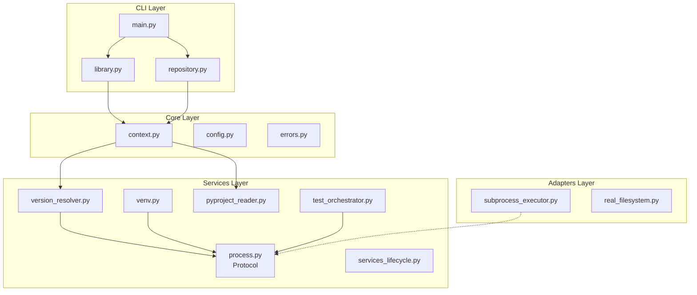

# OARepo CLI Architecture Summary

## Executive Summary

This document provides a concise overview of the architecture for replacing OARepo shell-script runners with a Python implementation. For detailed information, see the linked documents.

---

## 1. Problem Statement

The current OARepo development workflow relies on three bash scripts:
- `library_runner.sh` - Manages Python library development environments
- `repository_runner.sh` - Manages Invenio repository instances  
- `repository_installer.sh` - Scaffolds new repositories from templates

**Issues with current approach:**
- Shell scripting limitations (parsing, error handling, type safety)
- Fragile TOML parsing via `grep/sed/awk`
- Global mutable state through exported variables
- Difficult to test and maintain
- No cross-platform abstraction
- Security risks from shell string interpolation

**Goal:** Replace with maintainable, testable Python CLI while preserving all user-facing behavior.

---

## 2. Solution Overview

### Architecture Name: oarepo-cli

A single Python executable with subcommand groups:
```bash
oarepo-cli library <command>     # Library runner replacement
oarepo-cli repository <command>  # Repository runner replacement
oarepo-cli repo-install          # Repository installer
```

**Key Design Decisions:**
1. **Typer framework** - Type-safe CLI with auto-generated help
2. **Single executable** - Shared config/state between modes
3. **Dependency injection** - Testable abstractions around subprocess/filesystem
4. **No shell=True** - Safe process execution with list arguments
5. **tomllib parser** - Robust TOML parsing (Python 3.11+)
6. **Preserved compatibility** - Same commands, options, exit codes

---

## 3. Package Structure

```
oarepo_cli/
├── cli/              # Typer command definitions
│   ├── main.py       # Root CLI group
│   ├── library.py    # Library subcommands
│   └── repository.py # Repository subcommands
├── core/             # Domain models & context
│   ├── context.py    # ProjectContext discovery
│   ├── config.py     # Configuration model
│   └── errors.py     # Exception hierarchy
├── services/         # Business logic
│   ├── process.py    # ProcessExecutor protocol
│   ├── venv.py       # Virtual environment management
│   ├── version_resolver.py
│   ├── pyproject_reader.py
│   └── ...           # Other domain services
└── adapters/         # Concrete implementations
    ├── subprocess_executor.py
    ├── real_filesystem.py
    └── fake_*        # Test doubles
```

**See:** [00-main-architecture.md](./00-main-architecture.md) for full feature inventory  
**See:** [01-detailed-design.md](./01-detailed-design.md) for component specifications

---

## 4. Component Diagram



---

## 5. Key Interfaces

### ProcessExecutor Protocol

```python
@dataclass
class ProcessResult:
    returncode: int
    stdout: str
    stderr: str
    command: Sequence[str]
    duration_ms: int

class ProcessExecutor(ABC):
    @abstractmethod
    def run(
        self,
        command: Sequence[str],
        *,
        cwd: Optional[Path] = None,
        env: Optional[dict[str, str]] = None,
        check: bool = True,
    ) -> ProcessResult: ...
```

**Purpose:** Abstract subprocess execution for testability. Never uses `shell=True`.

### VirtualEnvironmentManager

```python
class VirtualEnvironmentManager:
    def ensure_venv(self, requirements: VenvRequirements, force: bool = False) -> Path: ...
    def upgrade_environment(self) -> None: ...
    def cleanup(self) -> None: ...
```

**Purpose:** Manage Python virtual environments via `uv`.

### PyProjectReader

```python
class PyProjectReader:
    def read(self, path: Path) -> PyProjectData: ...
    
    @property
    def name(self) -> str: ...
    @property
    def oarepo_versions(self) -> list[int]: ...
    @property
    def requires_python(self) -> str: ...
```

**Purpose:** Parse `pyproject.toml` using `tomllib` with typed accessors.

**See:** [01-detailed-design.md](./01-detailed-design.md) §6 for complete interface specifications

---

## 6. Testing Strategy

### Test Pyramid

```
                    Characterization Tests (Bash vs Python)
                Integration Tests (real tools, isolated dirs)
            Workflow Tests (fakes, complete scenarios)
        Contract Tests (adapter protocol compliance)
    Unit Tests (pure logic, fastest, most numerous)
```

### Test Distribution

| Type | Count | Runtime | Coverage Goal |
|------|-------|---------|---------------|
| Unit | 200+ | <1s each | 90%+ lines |
| Contract | 30+ | <5s each | All adapters |
| Workflow | 50+ | <10s each | All workflows |
| Integration | 20+ | <60s each | Critical paths |
| Characterization | 40+ | <30s each | Command parity |

**See:** [02-testing-strategy.md](./02-testing-strategy.md) for complete testing documentation

---

## 7. Migration Plan

### Phase 1: Foundation (Week 1-2)
- Project scaffolding
- Typer CLI skeleton
- Core context discovery
- ProcessExecutor implementation
- Version resolver
- Error hierarchy

**Deliverable:** `oarepo-cli --help` matches shell script structure

### Phase 2: Library Runner Parity (Week 3-4)
- All library commands functional
- Characterization tests passing

### Phase 3: Repository Runner Parity (Week 5-6)
- All repository commands functional
- Integration tests passing

### Phase 4: Repository Installer (Week 7)
- Top-level `repo-install` command
- Copier integration

### Phase 5: Hardening (Week 8)
- Signal handling
- Lock file concurrency
- Documentation
- Performance benchmarking

**See:** [03-migration-guide.md](./03-migration-guide.md) for user migration instructions

---

## 8. Compatibility Matrix

### Must Preserve

- All command names and subcommands
- All flags and options
- Exit codes (0=success, non-zero=failure)
- stdout/stderr streams
- Help text structure
- Environment variable semantics
- `.env-services` file format
- JSON output from `oarepo-versions`

### May Improve with Warning

- `self-update` → deprecate in favor of `pip install --upgrade`
- Exported environment variables → read-only, no parent mutation
- Error message formatting → clearer, more structured

### Intentionally Deprecated

- Shell script distribution model
- `.runner.sh` cached scripts  
- Bash-based TOML parsing
- **Self-update mechanism** (replaced entirely by pip package management)

---

## 9. Risk Assessment

| Risk | Likelihood | Impact | Mitigation |
|------|------------|--------|------------|
| Behavioral differences | Medium | High | Extensive characterization tests |
| Performance regression | Low | Low | Benchmark critical paths |
| Missing edge cases | Medium | Medium | Fuzz testing with malformed TOML |
| Concurrent execution bugs | Low | High | File-based locking |
| Secrets in logs | Medium | High | Redaction middleware |
| Platform-specific bugs | Medium | Medium | CI on Linux + macOS |

---

### 10. Implementation Checklist

### Core Infrastructure
- [ ] Project setup (Poetry/pip, ruff, ty, pytest)
- [ ] Typer CLI skeleton with global options
- [ ] ProjectContext discovery and validation
- [ ] CliConfig model with env/file loading
- [ ] Exception hierarchy (OARepoError base class)
- [ ] Platform detection utilities
- [ ] Signal handling for long-running processes

### Adapters
- [ ] SubprocessExecutor (never shell=True)
- [ ] RealFileSystem wrapper
- [ ] RealEnvironmentProvider
- [ ] HTTPClient for downloads
- [ ] Fake implementations for testing

### Services
- [ ] PyProjectReader with tomllib
- [ ] VersionResolver (Python/OARepo detection)
- [ ] VirtualEnvironmentManager (uv integration)
- [ ] ServicesLifecycleManager (Docker orchestration)
- [ ] TestOrchestrator (pytest, coverage)
- [ ] TranslationManager
- [ ] ModelManager (copier integration)
- [ ] LocalPackageManager
- [ ] IndexManager
- [ ] ServerRunner

### CLI Commands
- [ ] Library: venv, upgrade, start, stop, test
- [ ] Library: clean, shell, invenio, translations
- [ ] Library: lint, format, license-headers, jslint, jstest
- [ ] Library: oarepo-versions
- [ ] Library: **self-update REMOVED** (not implemented)
- [ ] Repository: install, upgrade, services
- [ ] Repository: model, local, run, cli
- [ ] Repository: translations, index, reset, info
- [ ] Repository: **self-update REMOVED** (not implemented)
- [ ] Top-level: repo-install

### Testing
- [ ] Unit tests for parsers, resolvers, configs
- [ ] Contract tests for adapters
- [ ] Workflow tests with fakes
- [ ] Integration tests with real tools
- [ ] Characterization tests (bash vs python)
- [ ] Fault tolerance tests

### Documentation
- [ ] README.md with installation
- [ ] Architecture decisions (ADRs)
- [ ] Migration guide
- [ ] API documentation
- [ ] Contributing guidelines

---

## 11. Success Criteria

### Functional
- ✅ All shell script commands have Python equivalents
- ✅ Exit codes match for identical inputs
- ✅ Help text contains same commands/options
- ✅ Behavior is identical for common workflows

### Non-Functional
- ✅ 90%+ code coverage
- ✅ Zero `shell=True` usage
- ✅ Type annotations throughout (checked with ty)
- ✅ No global mutable state
- ✅ Deterministic behavior for non-interactive commands
- ✅ Cross-platform (Linux, macOS)
- ✅ Sub-second startup for lightweight commands

### Operational
- ✅ Easy installation via pip
- ✅ Clear error messages
- ✅ Structured logging option
- ✅ Graceful signal handling
- ✅ Concurrent execution protection

---

## 12. Open Questions

1. **Windows support?**  
   Current scripts target Linux/macOS. WSL2 recommendation for Windows users?

2. **Minimum Python version?**  
   tomllib requires Python 3.11+. Should we require 3.11+ or support older?

3. **Configuration file beyond pyproject.toml?**  
   Should we support `~/.config/oarepo/config.yaml` for user defaults?

4. **Plugin system?**  
   Future extensibility vs complexity tradeoff. Defer until v2.0?

5. **Telemetry?**  
   Anonymous usage metrics (opt-in)? Privacy considerations.

---

## 13. Glossary

| Term | Definition |
|------|------------|
| OARepo | Overarching repository platform |
| Library | Python package integrating with OARepo |
| Repository | Deployed Invenio RDM instance |
| Runner | Shell script or Python CLI orchestrating workflows |
| Venv | Python virtual environment |
| Copier | Template engine for scaffolding |
| uv | Fast Python package installer (Astral) |
| Typer | Python CLI framework based on Click |

---

## Appendix: Document Navigation

| Document | Purpose | Audience |
|----------|---------|----------|
| [00-main-architecture.md](./00-main-architecture.md) | Feature inventory, compatibility matrix, high-level design | Architects, maintainers |
| [01-detailed-design.md](./01-detailed-design.md) | Component specs, interfaces, diagrams | Developers implementing |
| [02-testing-strategy.md](./02-testing-strategy.md) | Test pyramid, examples, fixtures | QA, developers writing tests |
| [03-migration-guide.md](./03-migration-guide.md) | User migration instructions | End users, DevOps |

---

**Version:** 1.0.0  
**Last Updated:** 2026-08-01  
**Authors:** Senior Software Architect  
**Review Status:** Pending maintainer review
